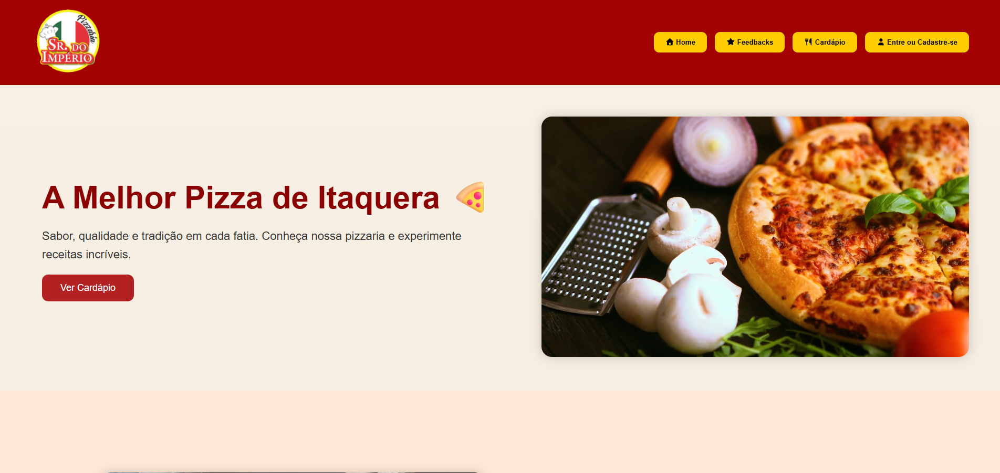
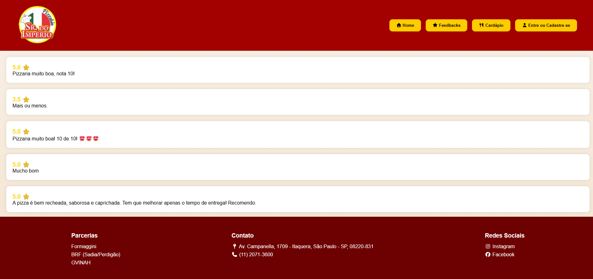
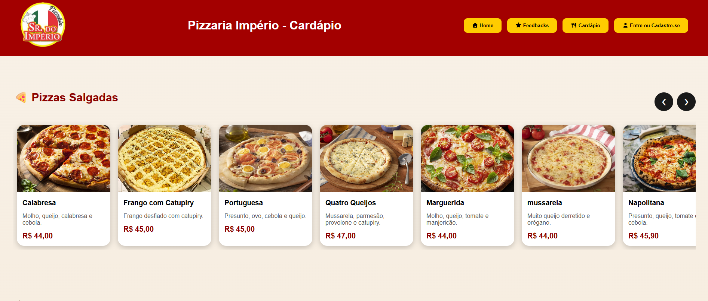
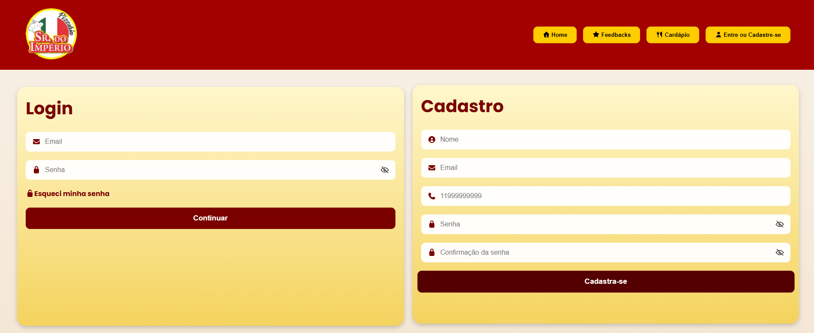
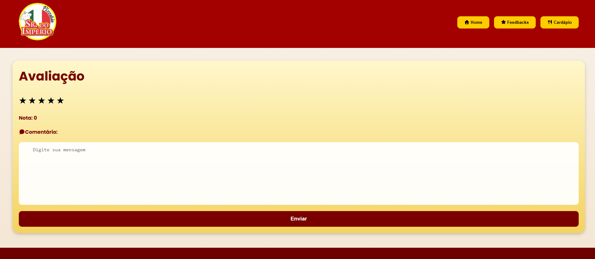
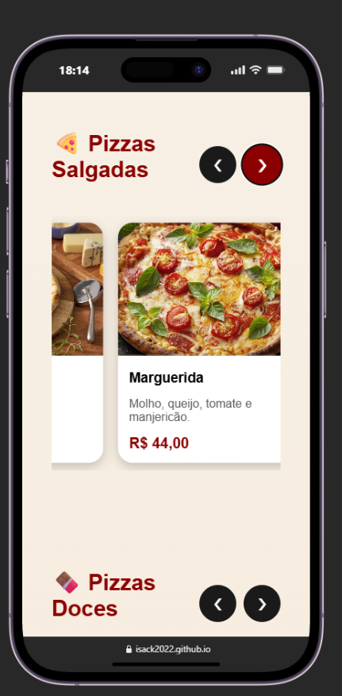

# 🍕 Pizzaria Império

Sistema web desenvolvido para uma pizzaria, permitindo cadastro de clientes, login autenticado e avaliação dos serviços.

## 🚀 Demonstração

### Front-end
https://isack2022.github.io/Pizzaria-Imperio/index.html

### API
https://node-pizzaria.onrender.com

---

## 📸 Funcionalidades

✅ Cadastro de clientes

✅ Login com JWT

✅ Proteção de rotas

✅ Cadastro de avaliações

✅ Avaliação com estrelas (0.5 até 5)

✅ Comentários dos clientes

✅ Integração com MySQL

✅ API REST em Node.js

---

## 🛠️ Tecnologias Utilizadas

### Front-end

- HTML5
- CSS3
- JavaScript

### Back-end

- Node.js
- Express

### Banco de Dados

- MySQL

### Autenticação

- JWT (JSON Web Token)
- Bcrypt

---

## 📂 Estrutura do Projeto

### Front-end

```bash
Pizzaria-Imperio/
│
├── css/
├── js/
├── imagens/
├── index.html
├── login.html
├── avaliacao.html
└── cardapio.html
```
---
## 📷 Imagens do site

### Tela incial


### Tela feedback


### Tela Cardápio


### Tela Login


### Tela avaliação


### Mobile




---

## 👨‍💻 Autor


GitHub:
https://github.com/Isack2022

Projeto Front-end:
https://github.com/Isack2022/Pizzaria-Imperio

Projeto API:
https://github.com/Isack2022/Node-Pizzaria